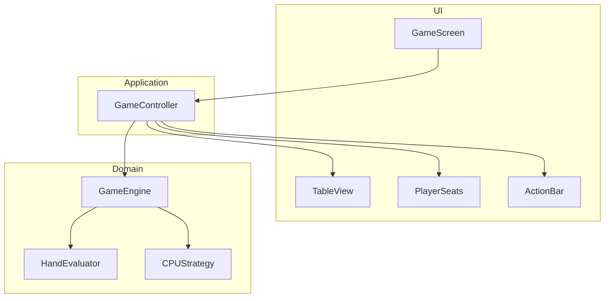
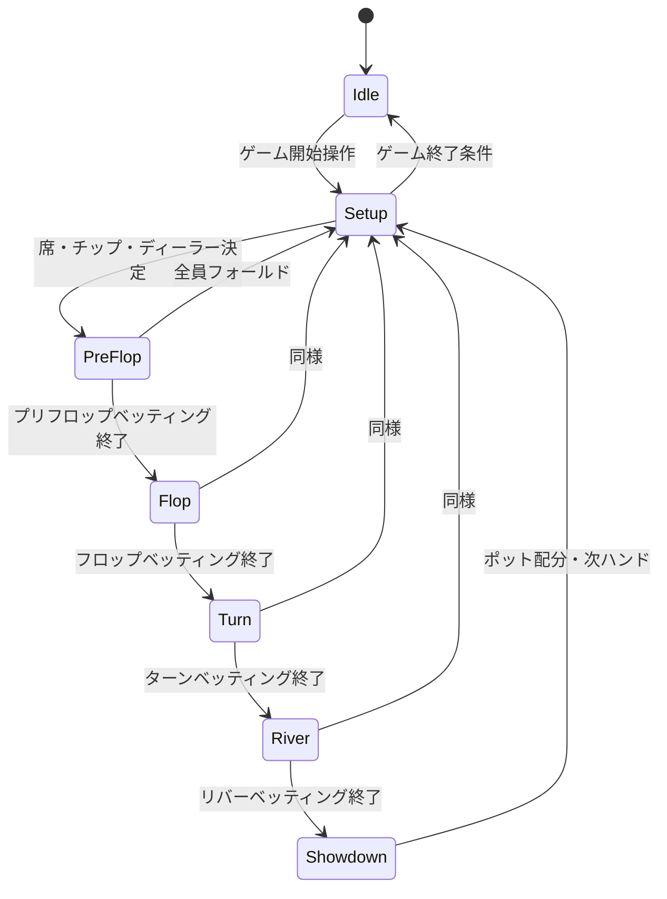
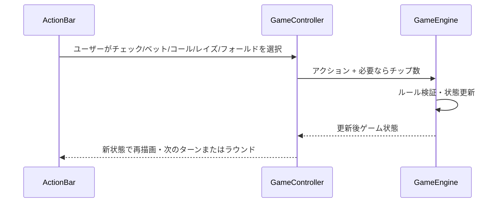

# Design Document: texas-holdem-webapp

---

**Purpose**: 実装の一貫性を保つため、アーキテクチャ・コンポーネント・インターフェース・データモデルを定義する。

---

## Overview

本機能は、テキサスホールデムのルールに従い、人間1人とCPU4人でプレイするWebアプリケーションを提供する。ディーラーはCPUが担当し、データベースは使わずブラウザのメモリのみでゲーム状態を保持する。ユーザーは手札・チップ・ベッティングアクションを明確に把握・操作でき、デザインはApple公式アプリに近いクリーンで階層の明確なUIとする。

**Users**: ブラウザでポーカーをプレイする1人の人間プレイヤー。

**Impact**: 新規SPAとしてリポジトリにフロントエンドを追加する。既存システムはない。

### Goals

- 要件 1〜8 を満たすテキサスホールデムの1セッション完結型ゲームを提供する。
- ゲームロジックをUIから分離し、単体テスト可能な境界を設ける。
- 役判定・ベッティング・ポット配分を標準ルールに従って正確に実装する。

### Non-Goals

- 複数タブ・複数デバイス間の同期、ログイン・永続化・ランキングは対象外。
- 高度なCPU戦略（学習・強化学習）は対象外。シンプルなルールベースのCPUとする。
- リアルマネー・課金・認証は対象外。
- 初版ではオールインは許容するが、ポットは単一としサイドポットは扱わない（要件 5.3）。

---

## Architecture

### Architecture Pattern & Boundary Map

採用パターン: **クライアント単体のレイヤー分離型SPA**。UI層とゲームロジック層を分離し、状態は単一のゲーム状態ツリーで保持する。

- **UI**: 表示とユーザー入力のみ。ゲームルールや状態遷移は知らない。
- **Application (GameController)**: ユーザー/CPUのアクションを受け、GameEngine に委譲し、得られた状態をUIに渡す。
- **Domain**: GameEngine（ハンド進行・ベッティング・勝者判定）、HandEvaluator（役判定）、CPUStrategy（CPUの行動決定）。いずれも純粋ロジックまたは状態更新のみ。

**Steering compliance**: ドキュメントにない機能は実装しない。将来拡張・最適化は考慮しない。

### Technology Stack

| Layer | Choice / Version | Role in Feature | Notes |
|-------|------------------|-----------------|-------|
| Frontend | React 18+ | 画面・インタラクション | コンポーネント単位で分割 |
| Language | TypeScript | 型安全なゲーム状態・インターフェース | any 禁止、明示的型定義 |
| State | クライアントメモリ（React state または 1 ストア） | ゲーム状態の保持 | 永続化なし、リロードで破棄 |
| Styling | Tailwind CSS | Apple風レイアウト・余白・タイポグラフィ | 設計で選定済み |
| Runtime | ブラウザ | 実行環境 | サーバー・DB なし |
| 役判定 | @pokertools/evaluator | 7枚→役ランク | 設計で選定済み、アダプタでラップ |

### ブラインド（要件 5.1）

- **額**: スモールブラインド（SB）・ビッグブラインド（BB）は固定額とする。具体値は実装時に定義する（例: SB=5, BB=10 など、初期チップ1000に対して妥当な水準）。
- **課し方**: ディーラーボタンを持つプレイヤーの左隣が SB、その左隣が BB をポストする。各ハンド開始時（プリフロップ前）に GameEngine が上記の席に応じてチップをポットに移動する。

---

## System Flows

### ゲームセッション・ハンド進行フロー

- 各ベッティングラウンドでは、人間のターンでアクションUIを表示し、CPUのターンで自動決定してから次のプレイヤーへ。全員フォールドまたはコールでラウンド終了。
- ショーダウンでは HandEvaluator で勝者を判定し、GameEngine がポットを配分したあと、ディーラーボタンを移動して次の Setup へ。
- **ゲーム終了条件（要件 8.3）**: 次のいずれかに該当したら phase を Idle に遷移し、必要に応じて「新しいゲームを始める」を表示する。(1) 人間プレイヤーのチップが 0 になった場合。(2) ユーザーが終了を選択した場合。(3) CPU が全員チップ 0（人間が全員に勝った場合）になった場合。

### 人間プレイヤーアクション処理

- ベット/レイズ時はチップ数をUIで指定し、GameEngine が最小・最大を検証する。無効なアクションは状態を変えずエラー情報を返す。

---

## Requirements Traceability

| Requirement | Summary | Components | Interfaces | Flows |
|-------------|---------|------------|------------|-------|
| 1.1, 1.2 | 参加者6（ディーラー1+プレイヤー5）、人間1+CPU4 | GameEngine, Setup | GameState, Player | Setup, ゲーム開始 |
| 1.3 | 人間の席をゲーム開始時にランダム決定 | GameEngine | setupNewGame | Setup |
| 1.4 | ディーラー業務をCPUが自動実行 | GameEngine, GameController | advancePhase, dealCards 等 | 全フェーズ |
| 2.1 | 初期チップ1000 | GameEngine, Setup | Player.chips, INITIAL_CHIPS | Setup |
| 2.2 | チップ表示・増減 | TableView, PlayerSeats, GameState | GameState.players | 全フェーズ |
| 2.3 | チップ0のプレイヤー扱い | GameEngine | Player, isEliminated / 参加可否 | Showdown, Setup |
| 3.1–3.3 | DB不使用・リロードで消失・メモリのみ | 全体方針 | 永続化なし | — |
| 4.1–4.3 | Apple風UI・視認性・操作明確 | GameScreen, TableView, ActionBar, スタイル | UI コンポーネント props | 全画面 |
| 5.1–5.5 | ブラインド・カード配布・ベッティング・役判定・ポット配分 | GameEngine, HandEvaluator | GameState, BetRound, evaluateHand | 全フロー |
| 6.1–6.3 | 人間のアクションUI・チップ指定・有効アクションのみ | ActionBar, GameController, GameEngine | Action type, validateAction | 人間ターン |
| 7.1–7.3 | CPUの自動行動・表示・ディーラー業務 | CPUStrategy, GameEngine, TableView | decideAction, GameState | CPUターン |
| 8.1–8.3 | ゲーム開始・ハンド終了後の継続・終了・再開 | GameController, GameEngine, UI | startGame, endHand, 終了条件 | Setup, Idle |

---

## Components and Interfaces

### コンポーネント概要

| Component | Domain/Layer | Intent | Req Coverage | Key Dependencies | Contracts |
|-----------|--------------|--------|--------------|------------------|-----------|
| GameScreen | UI | ゲーム画面のルート・レイアウト | 4.x | GameController (P0) | State |
| TableView | UI | テーブル・コミュニティカード・ポット表示 | 4.2, 5.x | GameState (P0) | State |
| PlayerSeats | UI | 各席のプレイヤー・チップ・手札（人間は自分のみフル表示） | 1.x, 2.2, 4.2 | GameState (P0) | State |
| ActionBar | UI | 人間のチェック/ベット/コール/レイズ/フォールド・チップ指定 | 6.1, 6.2, 6.3 | GameController (P0), GameState (P0) | Service, State |
| GameController | Application | ユーザー/CPUアクションの受付・GameEngine 呼び出し・状態反映 | 1.4, 6.x, 7.x, 8.x | GameEngine (P0), UI (P0) | Service, State |
| GameEngine | Domain | ハンド進行・ベッティング・配分・状態遷移 | 1.x, 2.x, 5.x, 7.3, 8.x | HandEvaluator (P0), CPUStrategy (P1) | Service |
| HandEvaluator | Domain | 7枚から最良5枚・役ランク判定 | 5.4, 5.5 | 外部ライブラリ (P0) | Service |
| CPUStrategy | Domain | CPUのフォールド/チェック/コール/ベット/レイズの決定 | 7.1 | GameState (P0) | Service |

---

### UI Layer

#### GameScreen

| Field | Detail |
|-------|--------|
| Intent | ゲーム画面のルート。テーブル・席・アクションバーを配置する。 |
| Requirements | 4.1, 4.2, 8.1 |

**Responsibilities & Constraints**
- ゲーム未開始時は「ゲーム開始」等の入口を表示する（8.1）。
- ゲーム中は TableView / PlayerSeats / ActionBar を配置し、GameController から受け取った状態を子に渡す。
- ゲーム終了時は「新しいゲームを始める」等の再開手段を提供する（8.3）。

**Dependencies**
- Inbound: GameController — 現在の GameState とコールバック (P0)
- Outbound: TableView, PlayerSeats, ActionBar — 表示と入力 (P0)

**Contracts**: State [x]

##### State Management
- 表示に必要な状態は親（GameController が持つ状態）から props で受け取る。GameScreen 自身はゲーム状態を保持しない。

**Implementation Notes**
- Apple風のため、余白・フォントサイズ・階層を意識したレイアウトとする。実装でスタイル詳細を定義する。

---

#### TableView

| Field | Detail |
|-------|--------|
| Intent | テーブル上面のコミュニティカード・ポット・現在のベッティングラウンドの視覚表示。 |
| Requirements | 4.2, 5.1, 5.2 |

**Responsibilities & Constraints**
- コミュニティカード（0〜5枚）とポット額を表示する。カード・チップは視覚的に判別可能とする。

**Dependencies**
- Inbound: GameState（コミュニティカード、ポット、ラウンド）(P0)

**Contracts**: State [x]

**Implementation Notes**
- プレゼンテーション専用。ビジネスルールは持たない。

---

#### PlayerSeats

| Field | Detail |
|-------|--------|
| Intent | 各席のプレイヤー（人間/CPU）・チップ数・手札（人間は自分の2枚を表示）・フォールド状態の表示。 |
| Requirements | 1.1, 1.2, 2.2, 4.2, 7.2 |

**Responsibilities & Constraints**
- 人間プレイヤーの席は GameState の人間プレイヤーIDに基づき強調表示する。
- チップ数は常に表示し、ベット・配分で増減が分かるようにする。
- CPUの手札はショーダウン時またはフォールド後など、ルールで見せてよいタイミングでのみ表示する。

**Dependencies**
- Inbound: GameState.players, 人間プレイヤーID (P0)

**Contracts**: State [x]

**Implementation Notes**
- 席の並び（円形・楕円等）は実装で決定。デザイン原則（4.1）に沿う。

---

#### ActionBar

| Field | Detail |
|-------|--------|
| Intent | 人間プレイヤーのターン時に、チェック・ベット・コール・レイズ・フォールドとチップ数指定を提供する。 |
| Requirements | 6.1, 6.2, 6.3 |

**Responsibilities & Constraints**
- 人間のターン時のみ表示し、選択可能なアクションだけを有効にする（例: チェック可能時のみチェックを有効）。ルール違反の選択は送信しない。
- ベット/レイズ時はスライダー・入力欄・クイックベットのいずれかでチップ数を指定する手段を提供する。

**Dependencies**
- Inbound: GameController — アクション送信 (P0)、GameState — 現在のベット・最小レイズ等 (P0)
- Outbound: ユーザーが選択したアクションとオプション（チップ数）を GameController に渡す (P0)

**Contracts**: Service [x], State [x]

##### Service Interface
- `onAction(action: PlayerAction): void` — ユーザーが選択したアクションを GameController に通知する。GameController が GameEngine を呼び出し、検証は Engine 側で行う。

**Implementation Notes**
- 最小・最大ベット/レイズは GameState から受け取り、UIで制約をかける。無効な値は送信しない。

---

### Application Layer

#### GameController

| Field | Detail |
|-------|--------|
| Intent | ゲーム状態の保持と、ユーザー/CPUアクションの受付・GameEngine への委譲・UI更新の駆動。 |
| Requirements | 1.4, 6.x, 7.x, 8.x |

**Responsibilities & Constraints**
- 単一の GameState を保持する。ユーザーがアクションを送ったら GameEngine に渡し、返却された新状態で更新する。
- CPUのターンでは GameEngine（または CPUStrategy）に行動を決定させ、同様に状態を更新してから次のプレイヤーまたはフェーズへ進める。
- ゲーム開始・ハンド終了・ゲーム終了条件の判定を GameEngine に委譲し、その結果で状態を更新する。

**Dependencies**
- Inbound: UI（ActionBar からのアクション、GameScreen からの開始/終了操作）(P0)
- Outbound: GameEngine — 全状態遷移 (P0)、UI コンポーネント — 状態の受け渡し (P0)

**Contracts**: Service [x], State [x]

##### Service Interface（概念）
- `startGame(): void` — 席・人間位置・初期チップを設定し、最初のハンドを開始する（1.3, 2.1, 8.1）。
- `dispatchPlayerAction(playerId: string, action: PlayerAction): void` — 人間のアクションを Engine に渡し、状態を更新。必要なら CPU ターンを連続で進める。
- `getState(): GameState` — 現在のゲーム状態を返す（UI が購読する想定）。

##### State Management
- GameState を 1 ツリーで保持。リロードで破棄（3.x）。

**Implementation Notes**
- React では useReducer または 1 つの state + setState で GameState を保持する形が想定される。非同期は不要（CPU の「考える」遅延は UI でタイマー表現するかは実装に委ねる）。

---

### Domain Layer

#### GameEngine

| Field | Detail |
|-------|--------|
| Intent | テキサスホールデムのルールに基づくハンド進行・ベッティング・ポット集約・勝者判定・チップ配分・ディーラーボタン移動。 |
| Requirements | 1.1, 1.2, 1.4, 2.1, 2.2, 2.3, 5.1, 5.2, 5.3, 5.4, 7.3, 8.1, 8.2, 8.3 |

**Responsibilities & Constraints**
- 参加者6（ディーラー1+プレイヤー5）、人間1+CPU4、人間の席は開始時にランダム（1.1–1.3）。
- 各プレイヤー初期チップ1000（2.1）。ベット・フォールド・配分でチップを増減（2.2）。チップ0のプレイヤーは除外または参加不可（2.3）。
- ブラインド・ホールカード2枚・フロップ3・ターン1・リバー1の順で進行し、各ラウンドでベッティング（5.1, 5.2）。フォールド/チェック/ベット/コール/レイズを受理（5.3）。
- ショーダウンでは HandEvaluator で勝者を判定し、ポットを配分（5.4, 5.5）。ディーラーボタン移動・次ハンド準備（8.2）。ゲーム終了条件に達したら終了状態を返す（8.3）。

**Dependencies**
- Inbound: GameController — アクション・開始/終了の要求 (P0)
- Outbound: HandEvaluator — 役ランク取得 (P0)、CPUStrategy — CPUの行動決定 (P1)

**Contracts**: Service [x]

##### Service Interface（概念）
- `setupNewGame(): GameState` — 人間席をランダムに決定し、全プレイヤーに初期チップをセットした初期状態を返す。
- `applyAction(state: GameState, playerId: string, action: PlayerAction): Result<GameState, ActionError>` — アクションを検証し、有効なら新状態を返す。無効ならエラー。
- `advanceToNextTurn(state: GameState): GameState` — 次のプレイヤーへ。CPUの場合は CPUStrategy で行動を決定し、適用した状態を返す（必要なら複数ターン連続）。
- `evaluateShowdown(state: GameState): GameState` — 役判定とポット配分を行った後の状態を返す。

**Implementation Notes**
- 純粋関数またはイミュータブルな状態更新とする。日付・乱数は引数で渡すか、開始時にシードして再現可能にするとテストしやすい。

---

#### HandEvaluator

| Field | Detail |
|-------|--------|
| Intent | 7枚のカードから最良の5枚役を求め、役ランク（比較可能な値）を返す。 |
| Requirements | 5.4, 5.5 |

**Responsibilities & Constraints**
- テキサスホールデムの標準役（ハイカード〜ロイヤルストレートフラッシュ）に従う。同じ役の場合はキッカー等で比較可能なランクを返す。

**Dependencies**
- Outbound: 役判定ライブラリ（実装時に選定）(P0) — アダプタでラップし、ドメインは「7枚 → ランク」のみに依存する。

**Contracts**: Service [x]

##### Service Interface（概念）
- `evaluate(cards: Card[]): HandRank` — 7枚のカードから最良手のランクを返す。Card と HandRank はドメインで定義する型。

**Implementation Notes**
- ライブラリの API を薄いアダプタで包み、アプリ全体では HandEvaluator のインターフェースのみに依存する。research.md の「役判定は既存ライブラリ」に従う。

---

#### CPUStrategy

| Field | Detail |
|-------|--------|
| Intent | 現在の GameState とプレイヤーIDに基づき、CPUの次のアクション（フォールド/チェック/コール/ベット/レイズ）を決定する。 |
| Requirements | 7.1 |

**Responsibilities & Constraints**
- ルールに従った有効なアクションのみを返す。ベット/レイズ時はチップ数も返す。
- 初版はシンプルなルールベース（例: 手札強さ・ポットオッズに基づく）でよい。高度なAIは対象外。

**Dependencies**
- Inbound: GameState, playerId (P0)
- Outbound: HandEvaluator（手札の強さを求める場合）(P1)

**Contracts**: Service [x]

##### Service Interface（概念）
- `decideAction(state: GameState, playerId: string): PlayerAction` — 有効なアクションのいずれかを返す。

**Implementation Notes**
- テストでは固定の state を渡して行動の一貫性を検証できるようにする。

---

## Data Models

### Domain Model

- **GameState**: ゲーム全体の状態。フェーズ（Idle / Setup / PreFlop / Flop / Turn / River / Showdown）、ディーラー位置、プレイヤー配列、コミュニティカード、ポット、現在のベッティングラウンドのベット状況、アクティブなプレイヤー索引などを含む。
- **Player**: プレイヤーID、人間/CPU フラグ、現在のチップ数、手札2枚、フォールド済みか、このラウンドでベットした額 等。
- **Card**: スートとランク。表示用と評価用の両方で一意に識別できる型。
- **HandRank**: 役の強さを比較可能な形で表す型。HandEvaluator の出力。
- **PlayerAction**: フォールド / チェック / コール / ベット / レイズ と、必要ならチップ数。

集約境界: GameState が集約ルート。1 ハンドの進行とポット配分は GameEngine が GameState を更新するトランザクション境界とする。

### Logical Data Model（クライアントメモリ内）

- **GameState**
  - phase: enum
  - dealerIndex: number
  - players: Player[]
  - communityCards: Card[]
  - pot: number
  - currentBet: number（このラウンドの現在のベット額）
  - currentPlayerIndex: number
  - humanPlayerId: string（人間のプレイヤーID。1.3 でランダムに決めた席に対応）
  - その他、ラウンド単位の情報等が必要なら追加。初版ではサイドポットは扱わずポットは単一とする（Non-Goals）。実装で詳細を固定する。

- **Player**
  - id: string
  - isHuman: boolean
  - chips: number
  - holeCards: Card[]（最大2）
  - folded: boolean
  - currentBetInRound: number

- **Card**
  - suit: enum（スペード等）
  - rank: enum（2〜A）

永続化は行わない（3.x）。一貫性は単一スレッド・同期更新で保つ。

### Data Contracts & Integration

- 外部との連携はなし。役判定ライブラリは「7枚 Card[] → HandRank」のインターフェースでラップし、アプリ内では HandEvaluator の型のみを参照する。

---

## Error Handling

### Error Strategy

- **無効なアクション**: 人間がルール上できないアクションを送った場合、GameEngine.applyAction はエラーを返し、状態は変更しない。UI はエラーメッセージを表示するか、ボタンを無効化して送信させない（6.3）。
- **不正な状態**: 通常の進行で発生しない不正な状態になった場合は、ゲームを Idle に戻し「新しいゲームを始める」を促す。ログに状態を残す（実装で方針を統一）。

### Error Categories and Responses

- **User Errors**: 無効なベット額・無効なアクション → フィールド/アクション単位のメッセージで理由を伝える。
- **System Errors**: 想定外の例外はキャッチし、画面に「問題が発生しました。ページを再読み込みしてください。」等のメッセージを表示する。データは永続化していないためリロードで復旧する。

### Monitoring

- 本機能ではサーバー・DB がないため、クライアント側のコンソールログまたはエラーハンドリングで十分とする。本設計では監視基盤は対象外。

---

## Testing Strategy

- **Unit Tests**: GameEngine の setupNewGame / applyAction / advanceToNextTurn / evaluateShowdown を、与えた状態とアクションに対して期待する状態になるか検証する。HandEvaluator の evaluate を既知の7枚で検証する。CPUStrategy.decideAction を固定状態で検証する。
- **Integration Tests**: GameController と GameEngine を組み合わせ、ゲーム開始 → 人間が数手アクション → ラウンド進行 までを状態で検証する。
- **E2E/UI Tests**: ゲーム開始 → 人間がチェック/ベット等を選択 → テーブル・チップ・カードが期待どおり変わることを Playwright 等で検証する（受け入れ基準に合わせてクリティカルパスを選ぶ）。

---

## Supporting References

- 役判定ライブラリの選定結果・API は実装時に research.md の References に追記する。
- GameState / Player / Card / HandRank / PlayerAction の具体的な型定義は実装時にコードで定義し、必要なら design.md の Supporting References にリンクする。
